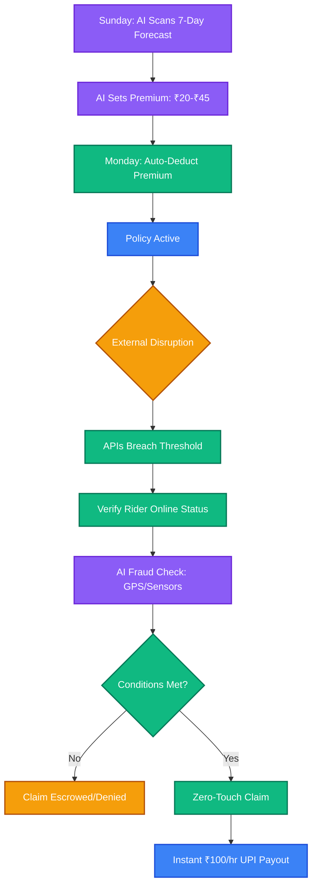
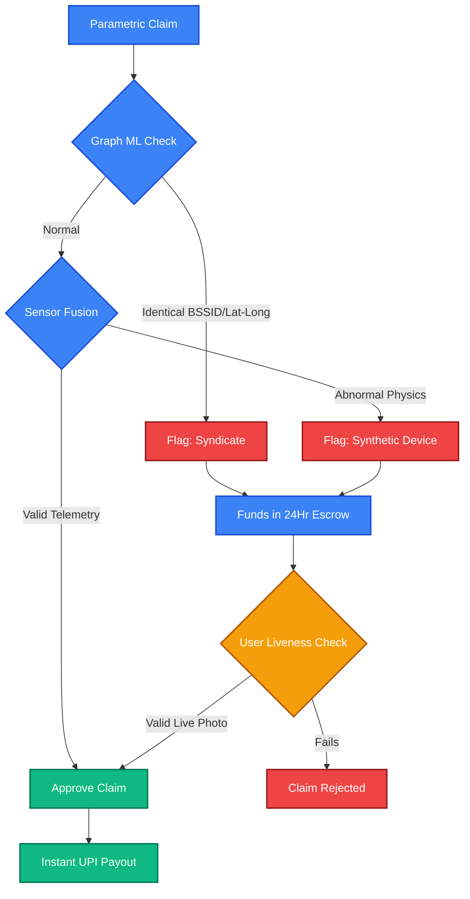

  <h1>⚡ Q-SURE</h1>
  <h3>AI-Powered Income Assurance for India's Gig Economy</h3>
  
  
  
    

  <strong>🏆 Guidewire DEVTrails 2026 - Phase 1 Submission</strong> 
  <strong>👥 Team:</strong> The Damned | <strong>🎯 Theme:</strong> Ideate & Know Your Delivery Worker

## 1. The Problem & Persona

**The Persona:** Q-Commerce / 10-Minute Grocery Delivery Partners (e.g., Zepto, Blinkit, Swiggy Instamart).

**The Core Vulnerability:**
Targeting the vulnerability of India's 8M+ gig and delivery workers, Q-Commerce riders operate within rigid 2–3 km micro-radii and rely on daily order streaks for a living wage. Localized disruptions—such as sudden torrential rain, political *Bandhs* (curfews), or VVIP gridlocks—paralyze local "Dark Stores." Riders absorb 100% of this financial shock with zero safety net.

**Our Solution:** **Q-Sure** is a zero-touch, AI-enabled parametric insurance platform guaranteeing hourly wage payouts when hyper-local external disruptions halt deliveries.

> ⚠️ **Golden Rule:** Q-Sure strictly covers **LOSS OF INCOME ONLY**. It explicitly excludes vehicle repairs, health insurance, or accident medical bills.

---

## 2. The Q-Sure Workflow (Ramesh, Bengaluru)

1. **Onboarding:** Ramesh links his platform ID. The AI maps his specific 3km operating zone.
2. **Weekly Coverage:** Based on weather/event forecasts, his dynamic premium is set at **₹35/week** and auto-deducted from his wallet on Monday.
3. **The Disruption:** On Wednesday at 4:00 PM, an unplanned local strike forces the Dark Store offline.
4. **Zero-Touch Claim:** Q-Sure's backend monitors NLP News Scrapers and Traffic APIs, detects the localized *Bandh*, and initiates an automated claim.
5. **Instant Payout:** Ramesh receives a push notification and an instant ₹200 UPI credit for 2 lost hours. No manual claim, no photos, no agents.

---

## 3. The Financial Architecture

Gig workers operate week-to-week, requiring a **Dynamic Weekly Micro-Premium Model**. Q-Sure retains a 15% platform fee from collected weekly premiums to ensure business viability.

| Component | Description |
| :--- | :--- |
| **AI Pricing Engine** | Base premium is ₹20/week. Recalculated every Sunday night based on 7-day risk forecasts (up to ₹45/week). |
| **Wage Replacement** | Pays a survival baseline of **₹100 per hour** of verified disruption. |
| **Liquidity Cap** | Payouts capped at ₹300/day or ₹1,000/week to protect against catastrophic, city-wide shutdowns. |

### Q-Sure Workflow Architecture

---

## 4. The 4 Parametric Triggers

We use **Multi-API Consensus** to trigger automated payouts, eliminating manual adjusters.

| Disruption Type | The Ground Reality | Automated Trigger Logic |
| :--- | :--- | :--- |
| **Flash Floods** | Underpasses flood instantly; bikes stall. | `OpenWeather (Rain > 15mm/hr)` **AND** `Traffic API (Speed < 8 km/h)` |
| **Extreme Heat** | 43°C heat mandates algorithmic breaks, losing prime hours. | `Weather (Temp > 42°C)` **AND** `Platform API (Status == Forced Break)` |
| **Strikes / Bandhs** | Markets shut down instantly with zero warning. | `NLP Scraper (High "Strike" alerts)` **AND** `Platform API (Store Offline)` |
| **VVIP Gridlocks** | Convoys barricade 2km zones, destroying 10-minute SLAs. | `Traffic API (Speed < 2 km/h for 45m)` **AND** `Rider GPS (Inside Polygon)` |

---

## 5. Platform Architecture

* **📱 Rider Platform (PWA):** Zero-friction onboarding with a native-like mobile experience. Critical for gig workers who manage everything via smartphones.
* **💻 Insurer Platform (Next.js Desktop Web):** Provides maximum screen real estate for underwriters to monitor live geospatial heatmaps, Graph ML fraud networks, and Loss Ratios.
## 📱 App Interface & Mockups

  <table>
    <tr>
      <td align="center"></td>
      <td align="center"></td>
      <td align="center"></td>
    </tr>
    <tr>
      <td align="center"><b>1. Zone Mapping</b></td>
      <td align="center"><b>2. Active Coverage</b></td>
      <td align="center"><b>3. Zero-Touch Payout</b></td>
    </tr>
  </table>

---

## 6. Adversarial Defense Strategy

To protect liquidity from GPS-spoofing syndicates, Q-Sure utilizes a **4-Layer Defense Architecture**.

| Defense Layer | Technology | Mechanism |
| :--- | :--- | :--- |
| **1. Sensor Fusion** | Isolation Forest | Analyzes device telemetry (Barometer/Accelerometer) to flag impossible physics (e.g., claiming a flood while on a 12th floor). |
| **2. Graph ML** | Network Graphing | Freezes payouts if a botnet cluster is detected (e.g., 50 identical lat/longs or shared BSSIDs). |
| **3. Trajectory Check** | GPS Breadcrumbs | Validates continuous physical movement to ensure the rider was online 30 minutes *prior* to the disruption. |
| **4. UX Escrow** | Liveness Check | Flagged claims enter a 24-hour Escrow. Riders can override the AI block instantly by uploading a live, EXIF-stamped photo. |

### Anti-Spoofing AI Workflow

---

## 7. Tech Stack

| Domain | Technologies Used |
| :--- | :--- |
| **Frontend** | Next.js (React), TailwindCSS, PWA Config |
| **Backend / MLOps** | Python (FastAPI), Scikit-learn, LightGBM |
| **Database** | PostgreSQL with PostGIS |
| **Integrations** | OpenWeather API, Mock Traffic API, Razorpay Sandbox |
| **Guidewire Ecosystem** | PolicyCenter (Dynamic Premium Sync), ClaimCenter APIs (Automated Payout Triggers) |

---

## 8. 6-Week Development Roadmap

* **Weeks 1-2 (Ideation):** Lock in persona, define micro-radius vulnerabilities, design mathematical premium models, and build Figma mockups.
* **Weeks 3-4 (Automation):** Develop FastAPI backend, connect mock APIs, train baseline LightGBM pricing model, and build the Next.js Insurer map.
* **Weeks 5-6 (Scale & Polish):** Finalize Isolation Forest fraud detection, integrate Razorpay Sandbox for UPI mockups, compile analytics dashboard, and record the final demo video.

---

## 9. Deliverables

  
  &nbsp;&nbsp;
  

 

> *"Protecting the backbone of India's fast-paced digital economy, one micro-premium at a time."*
